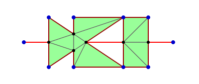

# polygon-winding-solver

A small utility to find interior regions of a plane graph consisting of multiple directed polygon paths according to the [non-zero winding rule](https://en.wikipedia.org/wiki/Nonzero-rule) and triangulate the interior.

A [demo](https://beanandbean.github.io/polygon-winding-solver/example/dist/) is available via GitHub Pages. The local version is available at `example/dist/index.html`, and is built by running `yarn build-example`.

## Usage

```typescript
import triangulate from "polygon-winding-solver";
const path1 = [
  {x: 1, y: 0}, {x: 4, y: 2},
  {x: 4, y: 0}, {x: 1, y: 2}
];
const path2 = [
  {x: 2, y: 0}, {x: 5, y: 0},
  {x: 5, y: 2}, {x: 2, y: 2}
];
const path3 = [
  {x: 0, y: 1}, {x: 6, y: 1}
];
const result = triangulate([path1, path2, path3]);
```

This produces the following triangulation:



(Code to visualise the results is not part of the library. It can be found in the [demo](example/src/main.ts).)

The triangulation results are produced in the following format:
 - `result.trigs` stores an list of three-element arrays denoting the three vertices of each triangle (the light green triangles in the diagram above);
 - `result.edges` stores a list of two-element arrays denoting the exterior edges, where the start and end vertices of each edge are ordered such that the edge goes in the clockwise directions around the interior region (the dark red lines in the diagram above);
 - `result.conns` stores a list of two-element arrays denoting the connection edges that are not on the boundary of any interior region (the light red lines in the diagram).

## Custom triangulator

The winding number solver is designed to separate from the triangulation implementation and can feed its result into different triangulators. The builtin triangulator is a simplified version of the [earcut](https://github.com/mapbox/earcut) package.

To use a custom triangulator, you need to wrap it in a class implementing either of the following two interfaces, and pass an instance of the class as the second argument when calling `triangulate`. Example wrappers for using the original [earcut](https://github.com/mapbox/earcut) package and the [cdt2d](https://github.com/mikolalysenko/cdt2d) package can be found in the [demo](example/src/main.ts).

### Loop triangulator

```typescript
interface LoopTriangulator {
  readonly type: TriangulatorType.loop;

  // this triangulator triangulates a loop at a time;
  // assumes points in `loop` are in clockwise order
  triangulate(points: Point[], loop: number[]): Triangle[];
}
```

A loop triangulator is invoked once for each separate interior region existing in the diagram. The loops do not contain holes, as any hole will already be joined to the exterior boundary by adding connecting edges. You may also safely assume that no two loops are adjacent (i.e. share edges).

### Plane graph triangulator

```typescript
interface PlaneGraphTriangulator {
  readonly type: TriangulatorType.planeGraph;

  // this triangulator triangulates a whole graph simultaneously;
  // interior is decided using even-odd rule.
  // can assume that `edges` are clockwise around the interior
  triangulate(points: Point[], edges: EdgeIndex[]): Triangle[];
}
```

A plane graph triangulator is invoked just a single time for all and only the exterior edges in the whole graph (the dark red lines in the example diagram above). The edges are guaranteed to form a [planar straight-line graph](https://en.wikipedia.org/wiki/Planar_straight-line_graph) with no repeating or intersecting edges, so algorithms like constrained Delaunay triangulation can be applied directly. The interior regions of this simplified graph can be correctly decided using the [even–odd rule](https://en.wikipedia.org/wiki/Even%E2%80%93odd_rule).
